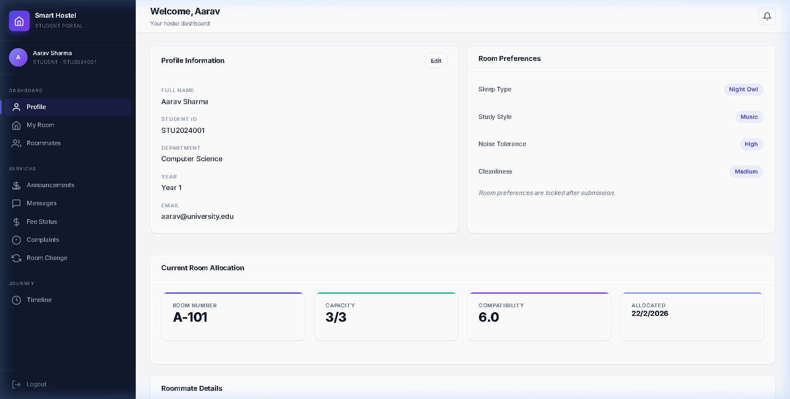
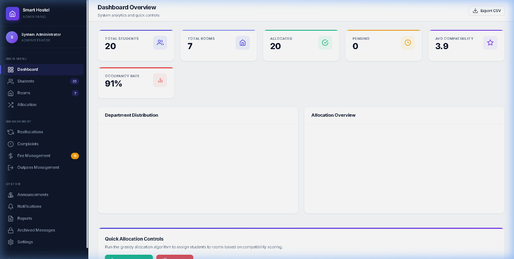
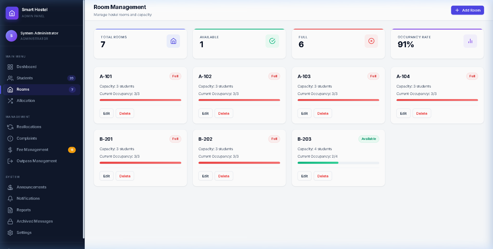
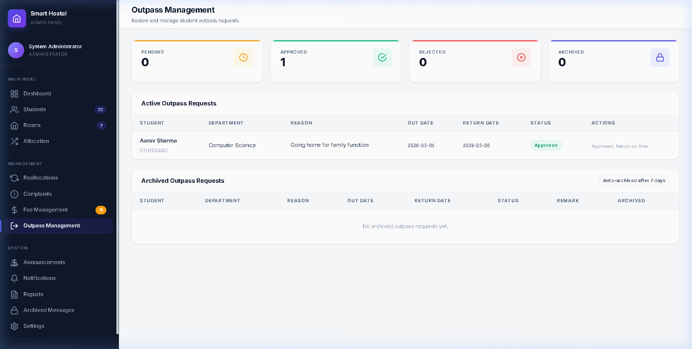

# 🏨 Smart Hostel Room Allocation System

A full-stack web application that automates hostel room allocation for universities using a **compatibility-scoring algorithm**. It matches students based on lifestyle preferences (sleep schedule, study habits, noise tolerance, cleanliness) to minimize roommate conflicts.

Built with **Node.js, Express, EJS, and SQLite**.

---

## 📸 Screenshots

| Student Dashboard | Admin Panel |
|:---:|:---:|
|  |  |

| Room Management | Outpass Management |
|:---:|:---:|
|  |  |

---

## ✨ What It Does

**Student Side** — Students register, set lifestyle preferences, get auto-assigned compatible roommates, pay fees via Razorpay, apply for outpass, file complaints, and chat with roommates.

**Admin Side** — Admins manage rooms, run the allocation engine, handle reallocation/outpass/complaint requests, configure fees, broadcast announcements, and view reports.

### Key Highlights
- 🧠 **Smart Allocation** — Compatibility algorithm scores student pairs and auto-assigns rooms
- 💳 **Razorpay Payments** — Integrated payment gateway for hostel fees
- 📋 **Outpass System** — Students apply, admins approve/reject, auto-archives after 7 days
- 📢 **Announcements** — Auto-delete after 30 days
- 💬 **Room Messaging** — Chat with roommates, messages auto-archive on expiry
- 🔔 **Notifications** — Real-time notification system for all actions

---

## 🚀 How to Run

```bash
# Clone
git clone https://github.com/Daadu06/HostelRoomAllocator.git
cd HostelRoomAllocator

# Install dependencies
npm install

# Set up environment variables
cp .env.example .env
# Add your Razorpay test keys in .env

# Seed sample data (optional)
npm run seed

# Start the app
npm start
```

**Student Portal** → http://localhost:3000 (`aarav@university.edu` / `student123`)
**Admin Panel** → http://localhost:3001 (`admin@university.edu` / `admin123`)

---

## 🛠️ Tech Stack

- **Backend** — Node.js, Express.js
- **Frontend** — EJS templates, Custom CSS
- **Database** — SQLite (via sql.js)
- **Payments** — Razorpay SDK
- **Auth** — express-session + bcryptjs
- **Security** — Helmet.js, parameterized queries

---

## 📂 Project Structure

```
├── db/             → Database schema & seed data
├── engine/         → Allocation algorithm & compatibility scoring
├── middleware/     → Auth guards (student/admin)
├── routes/         → Express route handlers
├── views/          → EJS templates (student + admin)
├── public/css/     → Stylesheet
├── start.js        → Main launcher (runs both servers + background jobs)
└── .env.example    → Environment variable template
```

---

## 🔐 Security

- Passwords hashed with bcrypt
- API keys stored in `.env` (never committed)
- Razorpay signature verification (HMAC-SHA256)
- Role-based middleware guards
- Helmet.js for HTTP security headers

---

## 👤 Author

**Daadu06** — [GitHub](https://github.com/Daadu06)
